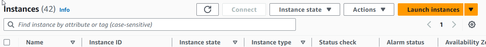
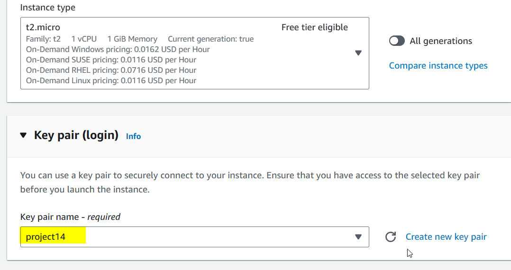
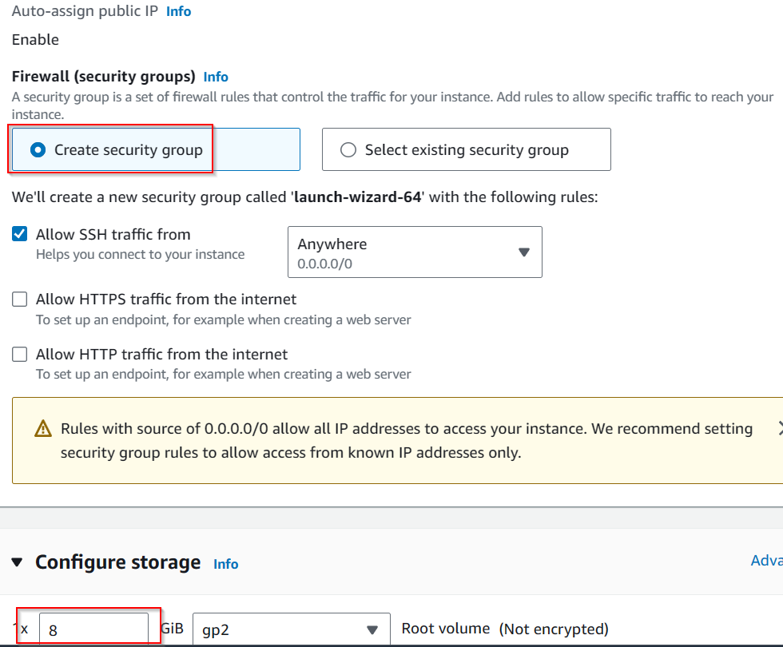
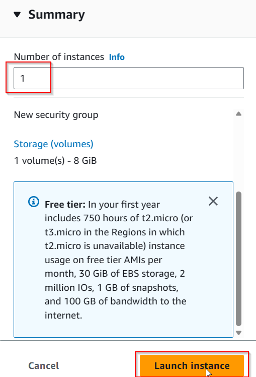

# How to deploy a simple NodeJS application in AWS EC2 server.

To package and host a simple NodeJS application,we would need to foolow these simple steps

1. Spin up an ec2 instance server with tag name :ApplicationsDeploy as shown below

