# How to deploy a simple NodeJS application in AWS EC2 server.

To package and host a simple NodeJS application,we would need to foolow these simple steps

1. Spin up an ec2 instance server with tag name : ApplicationsDeploy as shown below. Select an existing key pair and Launch an instance

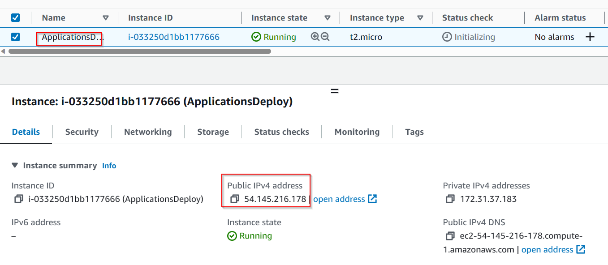

2. Click on connect button to get the SSH key and connect using the termius terminal

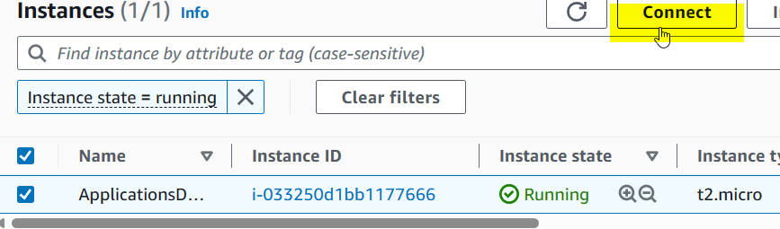

3. Put an hostname on the ubuntu server (ApplicationDeploy) and install an update and upgrade as shown below

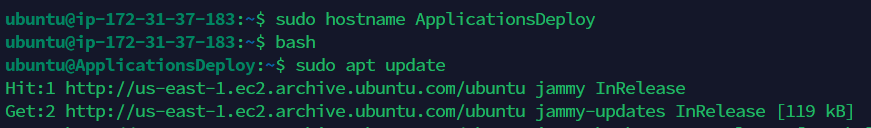

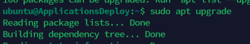

4.Proceed to install NodeJS ,check its version and install the npm dependencies

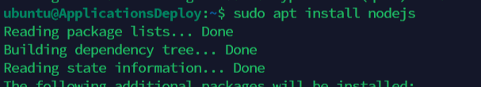

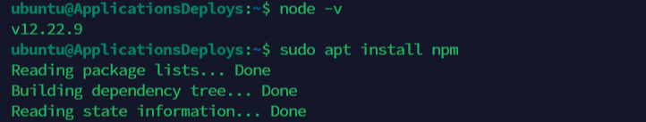

5. Install the ExpressJS

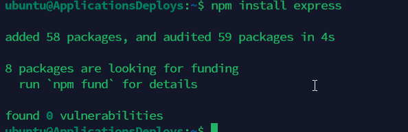

6.  Create a file using the vim editor and paste the NODEJS code inside it making a slight modification to reflect "NodeJs was successfully deployed".Please take note of the port number : 5000 which we would be adding to the security group sooner

Create a folder called Appylyzer and change directory into it.

`mkdir Appylyzer`
`cd Appylyzer`
`sudo vim Success.js`

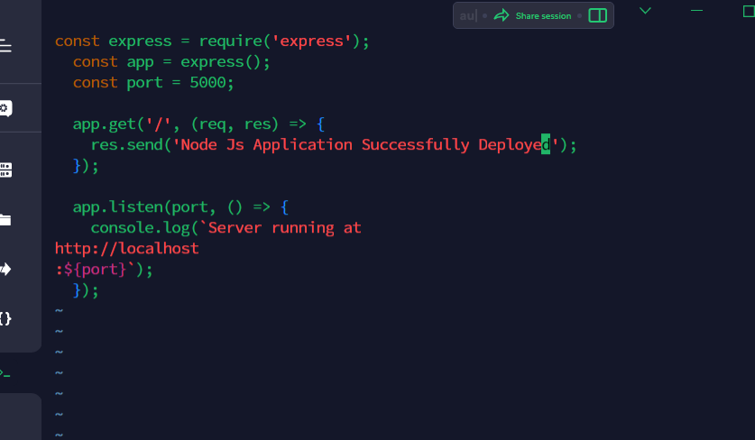

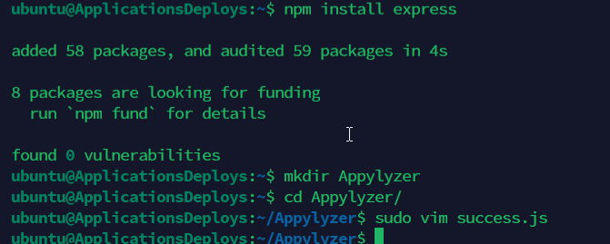

7. PM is installed on the nodeJS application which act as the production process manager that would enable us to use the terminal while the nodeJs server is running

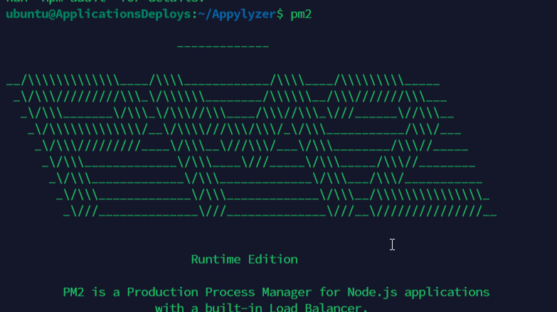

8. Navigate back to your AWS instance server and click to modify the security group

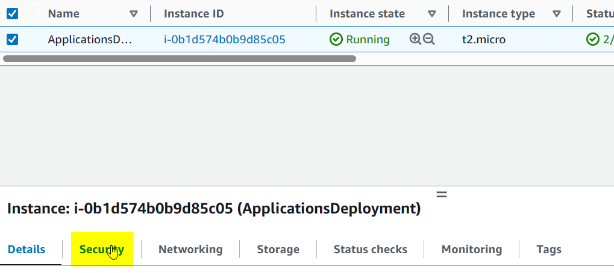

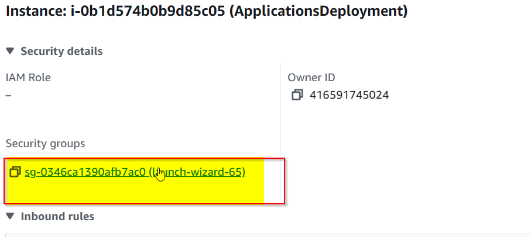

9. Click on Edit inbound rules to "Add and Save" new rule of port :5000 to allow us to connect with the application server

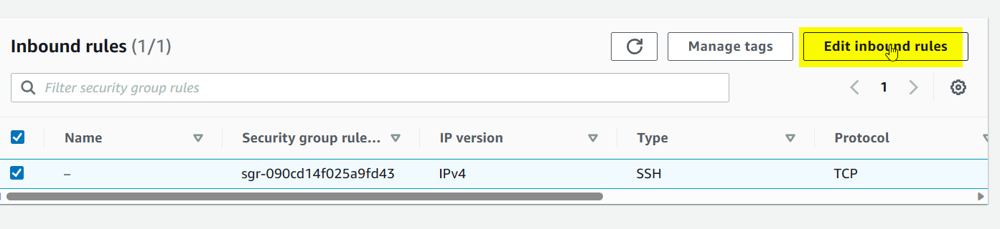

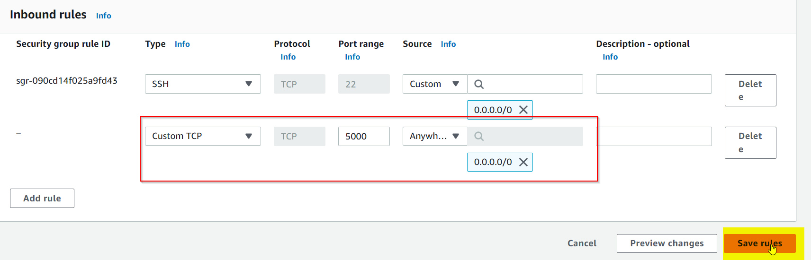

10. Launch your ip address on the browser at port:5000 .You would see that the application was successfully deployed

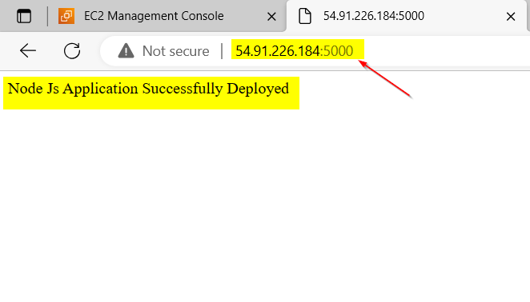

Congratulations !!!
